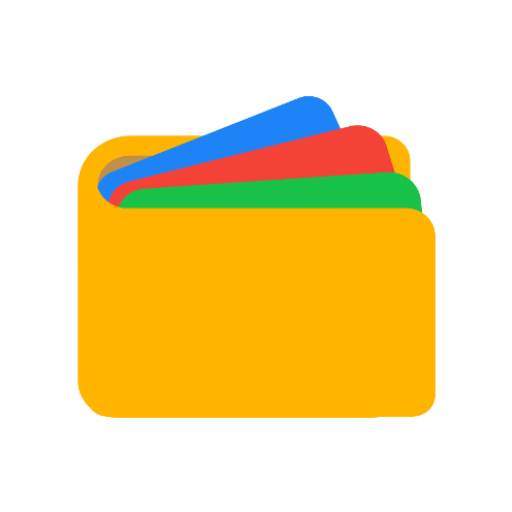

#  FossWallet

FossWallet is a free and open source (foss) .pkpass application.
Inspired by the venerable [PassAndroid](https://github.com/ligi/PassAndroid)-App,
I tried to recreate the necessary functionality in Material Design 3 and with modern
technologies.

## Installation

### Verification Info
To verify the authenticity of a FossWallet apk, use the following fingerprint:
* SHA256: `BF:8A:F6:D8:9E:55:95:D9:5F:4D:22:9E:C0:FD:97:1A:3C:75:2F:DB:AB:E8:33:77:23:0E:F9:2C:70:44:43:05`

## Translations
FossWallet can be translated via [Weblate](https://hosted.weblate.org/projects/fosswallet/app/).

